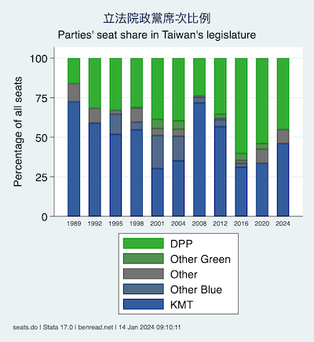

## [台灣民選的縣市長](full_images/executives.png), 1982-  [Elected city mayors and county magistrates in Taiwan](full_images/executives.png), 1982-

Note: 全尺寸版本請點擊圖像. Click image above for full-sized version. Elections for the mayors of the cities of Taipei and Kaohsiung were reintroduced in 1994. In 2010, Taichung County, Tainan County, and Kaohsiung County merged with their respective cities. Taoyuan was a county prior to the end of 2014.

## [台灣民選的女性縣市長](full_images/executives-women.png), 1982-  [Women elected as city mayors and county magistrates in Taiwan](full_images/executives-women.png), 1982-

Note: 全尺寸版本請點擊圖像. Click image above for full-sized version. 14 women had been elected to city mayor and county magistrate positions as of 2014. Elections for the mayors of the cities of Taipei and Kaohsiung were reintroduced in 1994. In 2010, Taichung County, Tainan County, and Kaohsiung County merged with their respective cities. Taoyuan was a county prior to the end of 2014.

## [立法院政黨席次比例](full_images/ly-party-by-year.png) [Parties' seat share in Taiwan's legislature](full_images/ly-party-by-year.png)

Note: 全尺寸版本請點擊圖像. Click image above for full-sized version.

歡迎讀者傳來各種評論、更改、和建議. Comments, corrections, and suggestions welcome.
