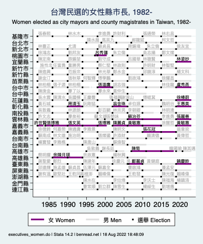

## 台灣民選的縣市長, 1985-  Elected city and county executives in Taiwan, 1985-

Note: 為了看全尺寸版本，請點擊以上圖像。 Click image above for full-sized version. Elections for the mayors of the cities of Taipei and Kaohsiung were reintroduced in 1994. In 2010, Taichung County, Tainan County, and Kaohsiung County merged with their respective cities.

## 台灣民選的女性縣市長, 1982-  Women elected as city and county executives in Taiwan, 1982-

Note: 為了看全尺寸版本，請點擊以上圖像。 Click image above for full-sized version. 14 women had been elected to city and county executive positions as of 2014. Elections for the mayors of the cities of Taipei and Kaohsiung were reintroduced in 1994. In 2010, Taichung County, Tainan County, and Kaohsiung County merged with their respective cities.

## 立法院政黨席次比例 Parties' seat share in Taiwan's legislature

Note: 為了看全尺寸版本，請點擊以上圖像。 Click image above for full-sized version.

歡迎讀者傳來各種評論、更改、和建議。 Comments, corrections, and suggestions welcome.
