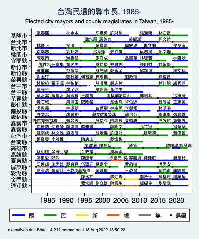

## 台灣民選的縣市長, 1985-  Elected city and county executives in Taiwan, 1985-

Note: Click image for full-sized version. Elections for the mayors of the cities of Taipei and Kaohsiung were reintroduced in 1994. In 2010, Taichung County, Tainan County, and Kaohsiung County merged with their respective cities.

