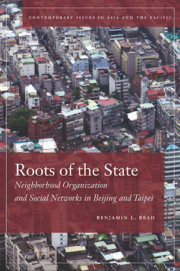

<u>Field Research in Political Science: Practices and Principles</u>  
By Diana <u>Kapiszewski</u> (Georgetown University), Lauren M. <u>MacLean</u> (Indiana University), and Benjamin L. <u>Read</u> (University of California, Santa Cruz)  
Cambridge University Press 2015

More on this book from the [publisher](http://www.cambridge.org/us/academic/subjects/politics-international-relations/research-methods-politics/field-research-political-science-practices-and-principles), the [project site](http://www.psfieldresearch.org/), and [Amazon](http://www.amazon.com/Field-Research-Political-Science-Principles/dp/0521184835/)

## Book summary

This book reconsiders the design and execution of field research in political science, and clarifies the roles it plays in the production of scholarship. Fieldwork &#8212; leaving one’s home institution in order to acquire data, information, or insights that significantly inform one’s research &#8212; remains common in most subfields of political science. Some scholars even see it as an essential rite of passage for graduate students. Yet its utility and necessity have been called into question, in part because the internet, computer databases, expanding archives of survey and even qualitative data, and the globalization of media all have made it possible to access troves of information without leaving one’s office. Some forms of analysis such as deductive formal modeling may also seem to obviate the need for field research. In particular, researchers have begun to question the necessity of the sorts of extended expeditions often associated with the term “fieldwork.”

We challenge the above point of view and argue that fieldwork remains an essential practice, for several fundamental reasons. Even in an era where instant communication across vast distances is commonplace, many kinds of new data can only be acquired through up-close, on-the-ground study. Further, by finding (and creating) data within its own context, researchers can benefit from serendipity, encounter emerging phenomena, grasp nuances, untangle causal processes, and confront gaps between concepts and reality. Engaging with the complex worlds of the human beings whose behavior and institutions we strive to understand, whether in person or through documents and records, enables empirical, conceptual, and theoretical departures. This is true whether research concerns historical events or current political phenomena, and regardless of whether we employ quantitative, qualitative, or multiple methods of analysis. Finally, fieldwork generates data that are useful at every point of the research cycle &#8212; from formulating or re-formulating a research question through testing hypotheses, identifying causal mechanisms, and building theory.

All these payoffs from field research are more likely to materialize the more effective scholars are at conducting their work in the field. Yet doctoral programs in political science at present provide little or no training in crucial skills. Our book thus addresses not merely the epistemological benefits of field research but also the organizational and practical aspects of translating a research design into on-site data collection. Indeed, we show that designing research, and designing field research (i.e. developing a practical plan for implementing one’s research design) are linked yet distinct processes, equally important for successful empirical inquiry. We also argue that political scientists should not be wedded to stereotyped templates of what fieldwork looks like. Rigorous field research can take a variety of forms in terms of time spent in the field, duration of each trip, number of sites, and approaches to data collection. The book presents guidelines for organizing projects in an efficient and directed manner while also staying flexible enough to benefit from unforeseen opportunities and insights.

Likewise, we encourage an understanding of fieldwork as a dynamic, iterative process in which the researcher does not plod through a linear sequence of steps, but rather repeatedly moves among research design, data collection, and analysis. Which approaches to data collection emerge as practical and what data are actually available may necessitate on-the-fly theoretical retooling and modifications in research design, with concomitant implications for the claims scholars can eventually make. We examine data collection techniques such as in-depth interviewing, survey research, ethnography, archival research, and others, exploring how they work in practice and in context. We show how scholars have coped with the inevitable trade-offs (for instance, between breadth and depth) that they face in implementing these techniques. We also suggest how field researchers can objectively evaluate their progress with respect to their analytic goals, and give a sense of the operational, intellectual, and interpersonal challenges that arise in the course of research. That is, our goal is to <i>contextualize</i> the various organizational and data-collection techniques we discuss, examining how scholars’ position and the context in which they are working affect their use.

The book draws on and converses with several areas of methodology including scholarship on fieldwork practices in cognate disciplines (i.e., history, sociology, and anthropology), monographs on particular data-collection techniques, the qualitative methods literature, and emerging studies of political science field research. It draws on innovative, real-world examples of fieldwork from across our discipline, as well as in-depth interviews with political scientists who have engaged in field research. And it incorporates an original survey of U.S. based faculty in the profession (conducted in 2011-12), which provides a broad portrait of field research practices.

## Table of Contents
+ Preface
+ Chapter 1. Field Research in Political Science: Practices and Principles
+ Chapter 2. A Historical and Empirical Overview of Field Research in the Discipline
+ Chapter 3. Preparing for Fieldwork
+ Chapter 4. Managing in the Field: Logistical, Social, Operational, and Ethical Challenges
+ Chapter 5. Thinking Outside the (Archive) Box: Discovering Data in the Field
+ Chapter 6. Interviews, Oral Histories, and Focus Groups
+ Chapter 7. Site-Intensive Methods: Participant Observation and Ethnography
+ Chapter 8. Surveys in the Context of Field Research
+ Chapter 9. Experiments in the Field
+ Chapter 10. Analyzing, Writing, and Retooling in the Field
+ Chapter 11. The Future of Field Research in Political Science
