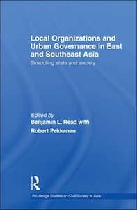

My research centers on local and grassroots politics in East Asia, mainly China and Taiwan. The process of trying to learn about these things has also stimulated me to write about field research and comparative methods. Below is an overview of my work, organized by topic. My full CV is [here](../about/BenRead-CurriculumVitae.pdf).

## Cambridge Elements / Politics and Society in East Asia

I co-edit a series of short books on politics and society in East Asia. Each Element takes stock of scholarship on an important issue or concept and advances an original argument about it. They are available in PDF and print editions, with some permanently open-access. Since the series started publishing in 2021, tens of thousands of readers have viewed and downloaded the various contributions.

These are some of the Elements published so far:

+ Melanie Manion, [Political Selection in China](https://www.cambridge.org/core/elements/abs/political-selection-in-china/C4AF6149B207555458FE21CA9746C792)
+ Margaret M. Pearson, Meg Rithmire, and Kellee Tsai, [The State and Capitalism in China](https://www.cambridge.org/core/elements/state-and-capitalism-in-china/621573281A601FF77F085386336A991D)
+ Yongshun Cai and Chih-Jou Jay Chen, [State and Social Protests in China](https://www.cambridge.org/core/elements/abs/state-and-social-protests-in-china/9758A610A0F88CD87A99A42DEC12F47D)
+ Sheena Chestnut Greitens, [Politics of the North Korean Diaspora](https://www.cambridge.org/core/elements/abs/politics-of-the-north-korean-diaspora/8E00C18DAD49699A9CD3D923F4683FED)

Full details [here](https://www.cambridge.org/core/publications/elements/politics-and-society-in-east-asia).

## Local Democracy in Taiwan

In Taiwan, as elsewhere, studies of democracy focus most on the national level. Here, I examine democratic practices and processes at the local level, particularly cities. The campaigns and activities of city councilors and neighborhood leaders provide a window on the workings of Taiwan's political system in ways that connect with ordinary people's lives.

I'm writing a book about accountability relationships between elected mayors and councils in Taiwan's cities and counties, based on extensive fieldwork as well as news reports and other sources.

### Articles, book chapters, and more from this project:

+ "Some Head Starts Are Bigger than Others: Dynastic Legacies and Variation in Candidate Quality in Taiwan's Local Elections" (Nathan F. Batto and Benjamin L. Read), <u>Japanese Journal of Political Science</u>, published online in advance of print, April 2024 [[open access](https://doi.org/10.1017/S1468109924000033)]
+ "Neighborhood Politics in Taipei: Democracy at the Most Local Level," in Ashley Esarey and Ryan Dunch, eds., <u>Taiwan in Dynamic Transition: Nation-Building, Globalization, and Democracy</u> (Seattle: University of Washington Press, 2020), pp. 95-120 [[pdf](../publications/ReadBenjaminL_2020_Neighborhood-Politics-in-Taipei--Democracy-at-the-Most-Local-Level.pdf)]
+ "Serial Interviews: When and Why to Talk to Someone More than Once," <u>International Journal of Qualitative Methods</u> Vol. 17, No. 1, first published June 26, 2018 [[journal](https://doi.org/10.1177/1609406918783452)] [[pdf](../publications/ReadBenjaminL_2018_Serial_Interviews_-_When_and_Why_to_Talk_to_Someone_More_than_Once.pdf)] &mdash; a methods paper that discusses the extent and limitations of power held by neighborhood wardens
+ "China–Taiwan Comparisons: Still Promising Though Not 'Ideal'," <u>Harvard Workshop on Chinese Politics</u>, revised February 23, 2018 [[pdf](../publications/ReadBenjaminL_2018_China-Taiwan_Comparisons.pdf)]
+ See [<u>Roots of the State</u>](roots.html) below
+ Graphs depicting various aspects of the [politics of Taiwan](../graphics/politics_in_taiwan.html) 

## State-Fostered Organizations

Early in my studies I became fascinated by ultra-local organizations that incorporate popular participation yet are fostered by governments and drawn upon for administrative purposes. They are unfamiliar in Western settings, but Japan, South Korea, Indonesia and other East and Southeast Asian countries feature tens of thousands of these structures, which operate at the neighborhood or village level and facilitate social welfare, public health, policing and other state functions.

The first such institution that I have studied is China's system of urban Residents' Committees (jumin weiyuanhui). My doctoral dissertation was based on fourteen months of fieldwork in Beijing and other cities, which included repeated visits to a set of ten RCs, along with interviews and a survey of 1,124 Beijing residents. I later conducted several rounds of follow-up research. Meanwhile, from 2003 on, I have also studied Taiwan's neighborhood administrative system, which constitutes a second example of such an institution. Urban neighborhoods (li) in Taiwan are headed by elected leaders (lizhang) who work with city government liaisons (liganshi) and choose a set of block captains (linzhang) to help them. Extensive interviews in Taipei and Chiayi, as well as a telephone survey of 1,140 Taipei residents, have helped me to understand this system.

I analyze and explain how ordinary citizens look upon and interact with these extensions of the state. I argue that the ways in which such organizations selectively draw upon and cultivate community networks highlight the efficacy of social capital, a concept theorized by scholars like James Coleman, Robert Putnam and Peter Evans &#8212; but also show its ability to further state projects, not just societal purposes. While China's authorities hold the RCs on a tight leash, Taiwan's lizhang system illustrates that institutions like these can evolve from authoritarian origins into highly democratic practices.

This book lays out the Chinese and Taiwanese cases in full detail and compares them to one another, also placing them in the context of other East and Southeast Asian cases:

+ <u>Roots of the State: Neighborhood Organization and Social Networks in Beijing and Taipei</u>, Stanford University Press 2012 [[abstract](roots.html)] [[publisher's page](http://www.sup.org/book.cgi?id=18646)] [[Google books](https://books.google.com/books?id=21_POQoSP4oC)] [[Amazon page](http://www.amazon.com/Roots-State-Neighborhood-Organization-Contemporary/dp/0804775656)]

I've also co-edited a book in which contributors compare varieties of such state-linked organizations in countries throughout the region, including Japan, Indonesia, Thailand, Vietnam, and Singapore:

+ <u>Local Organizations and Urban Governance in East and Southeast Asia: Straddling State and Society</u>, edited by Benjamin L. Read with [Robert Pekkanen](http://www.robertpekkanen.com), Routledge 2009 [[table of contents](straddlers.html)] [[abstracts](straddlers.html#abstracts)] [[publisher's page](http://www.routledgeasianstudies.com/books/Local-Organizations-and-Urban-Governance-in-East-and-Southeast-Asia-isbn9780415492997)] [[Google books](https://books.google.com/books?id=aoPUMmUsauoC)]

### Articles and book chapters from this project:

+ "Village Dispute Mediation, 2002–2010: An Enduring Institution amid Rural Change" (Benjamin L. Read and Ethan Michelson), <u>Asian Journal of Law and Society</u> Vol. 5, No. 2 (November 2018), pp. 433–452 [[journal](https://www-cambridge-org.oca.ucsc.edu/core/journals/asian-journal-of-law-and-society/article/village-dispute-mediation-in-china-200210-an-enduring-institution-amid-rural-change/2832CFE41040C7051D0D860DFB801502)] [[pdf](../publications/Read-Michelson_2018_Village_Dispute_Mediation_in_China_2002-10.pdf)]
+ "Theoretical Approaches to Neighborhood Governance: Searching for Lost Treasure and Comparative Frameworks," in Ngai-Ming Yip, ed., <u>Neighborhood Governance in Urban China</u> (Cheltenham, UK: Edward Elgar, 2014), pp. 25–39 [[pdf](../publications/ReadBenjaminL_2014_TheoreticalApproachesToNeighbourhoodGovernance.pdf)]
+ "Public Attitudes toward Official Justice in Beijing and Rural China" (Ethan Michelson and Benjamin L. Read), in Margaret Y. K. Woo and Mary E. Gallagher, eds., <u>Chinese Justice: Civil Dispute Resolution in Contemporary China</u> (Cambridge: Cambridge University Press, 2011), pp. 169-203 [[pdf](../publications/Michelson-Read_2011_AttitudesTowardOfficialJustice.pdf)]
+ "Mediating the Mediation Debate: Conflict Resolution and the Local State in China" (Benjamin L. Read and Ethan Michelson), <u>Journal of Conflict Resolution</u> Vol. 52, No. 5 (October 2008), pp. 737-764 [[abstract](http://jcr.sagepub.com/cgi/content/abstract/52/5/737)] [[pdf](../publications/Read-Michelson_2008_JCR_Mediation.pdf)] [[unabridged tables](../publications/Mediation_FullTables.doc)] [[replication](../publications/Mediation_Replication.zip)]
+ "The State's Evolving Relationship with Urban Society: China's Neighborhood Organizations in Comparative Perspective" (Benjamin L. Read and Chun-Ming Chen) in John R. Logan, ed., <u>Urban China in Transition</u> (Oxford: Blackwell Publishing, 2008), pp. 315-335 [[pdf](../publications/Read-Chen_2008_StatesRelationshipWithUrbanSociety.pdf)]
+ "State-Linked Associational Life: Illuminating Blind Spots of Existing Paradigms," in Benjamin L. Read with Robert Pekkanen, eds., <u>Local Organizations and Urban Governance in East and Southeast Asia: Straddling State and Society</u> (Abingdon, U.K.: Routledge, 2009), pp. 1-26 [[pdf](../publications/ReadBenjaminL_2009_ch1_StateLinkedAssociationalLife.pdf)], reprinted in <u>The Nature of the Nonprofit Sector</u>, 2nd ed., edited by J. Steven Ott and Lisa A. Dicke (Boulder, Colo.: Westview Press, 2012), pp. 385-401
+ "The Multiple Uses of Local Networks: State Cultivation of Neighborhood Social Capital in China and Taiwan," in Benjamin L. Read with Robert Pekkanen, eds., <u>Local Organizations and Urban Governance in East and Southeast Asia: Straddling State and Society</u> (Abingdon, U.K.: Routledge, 2009), pp. 121-157 [[pdf]("../publications/ReadBenjaminL_2009_ch6_MultipleUsesOfLocalNetworks.pdf)]
+ "Revitalizing the State's Urban 'Nerve Tips'," <u>The China Quarterly</u> No. 163 (September 2000), pp. 806-820 [[pdf](../publications/ReadBenjaminL_2000_ChinaQ_RevitalizingNerveTips.pdf)], reprinted in Andrew Kipnis, Luigi Tomba, and Jonathan Unger (eds.), <u>Contemporary Chinese Society and Politics</u>, Vol. 3 (London and New York: Routledge, 2009), pp. 33-48

## Civil Society Organizations

In other work, I've examined groups that are largely autonomous from state funding or control, in other words, civil society organizations. Prominent theories posit that such groups have a number of salutary, pro-democratic effects, such as inculcating habits of political participation in individuals and demanding accountability from governments. My work has focused on the nascent homeowner movement in China and its organizations (yezhu weiyuanhui). This research has aimed, among other things, to clarify the conditions under which civil society groups actually manifest positive effects in observable ways.

### Articles and book chapters from this project:

+ "Assessing Variation in Civil Society Organizations: China's Homeowner Associations in Comparative Perspective," <u>Comparative Political Studies</u> Vol. 41, Issue 9 (September 2008), pp. 1240-1265 [[abstract](http://cps.sagepub.com/cgi/content/abstract/41/9/1240)] [[pdf](../publications/ReadBenjaminL_2008_CPS_AssessingCSOs.pdf)] [[doi](http://journals.sagepub.com/doi/10.1177/0010414007302340)]
+ "Property Rights and Homeowner Activism in New Neighborhoods," in Li Zhang and Aihwa Ong, eds., <u>Privatizing China: Socialism from Afar</u> (Ithaca, N.Y.: Cornell University Press, 2008), pp. 41-56 [[pdf](../publications/ReadBenjaminL_2008_PropertyRightsHomeownerActivism.pdf)]
+ "Inadvertent Political Reform via Private Associations: Assessing Homeowners' Groups in New Neighborhoods," in Elizabeth J. Perry and Merle Goldman, eds., <u>Grassroots Political Reform in Contemporary China</u> (Cambridge, Mass.: Harvard University Press, 2007), pp. 149-173 [[pdf](../publications/ReadBenjaminL_2007_InadvertentPoliticalReform.pdf)]
+ "Democratizing the Neighborhood? New Private Housing and Homeowner Self-Organization in Urban China," <u>The China Journal</u>, Issue 49 (January 2003), pp. 31-59 [[pdf](../publications/ReadBenjaminL_2003_ChinaJ_DemocratizingTheNeighbourhood.pdf), reprinted in Jonathan Unger, ed. <u>Associations and the Chinese State: Contested Spaces</u> (Armonk, NY: M.E. Sharpe, 2008), pp. 216-252

## Methods: Field, Comparative, Qualitative

I use a range of different methods in my research, qualitative and quantitative. I don't aspire to be a methodologist per se. But over the years I've been inspired to write several papers and to coauthor a book about methods. The inspiration for all of it stems from experiences and questions I've encountered in my own work.

+ <u>Field Research in Political Science: Practices and Principles</u>, Cambridge University Press 2015 [[abstract](frps.html)] [[publisher's page](http://www.cambridge.org/us/academic/subjects/politics-international-relations/research-methods-politics/field-research-political-science-practices-and-principles)] [[project site](http://www.psfieldresearch.org/)] [[Amazon page](http://www.amazon.com/Field-Research-Political-Science-Principles/dp/0521184835/)]

### Articles and book chapters from this project:

+ "Pluralism in Practice: How Fieldwork Can Strengthen Diversity and Engagement in Political Science" (Diana Kapiszewski, Lauren M. MacLean, and Benjamin L. Read), in Janet M. Box-Steffensmeier et al., ed., <u>Oxford Handbook of Engaged Methodological Pluralism in Political Science</u> Vol. 1 (Oxford: Oxford University Press, 2024) [[pdf](../publications/Kapiszewski+MacLean+Read_2024_Pluralism-in-Practice--How-Fieldwork-Can-Strengthen-Diversity-and-Engagement-in-PS.pdf)]
+ "Dynamic Research Design: Iteration in Field-Based Inquiry” (Diana Kapiszewski, Lauren M. MacLean, and Benjamin L. Read), <u>Comparative Politics</u> Vol. 54, No. 4 (July 2022), pp. 645-670. [[pdf](../publications/Kapiszewski+MacLean+Read_2022_Dynamic-Research-Design--Iteration-in-Field-Based-Inquiry.pdf)]
+ "Problems and Possibilities of Comparison Across Regime Types: Examples Involving China," in Erica S. Simmons and Nicholas Rush Smith, eds., <u>Rethinking Comparison</u> (Cambridge: Cambridge University Press, 2021), pp. 208-230. [[pdf](../publications/ReadBenjaminL_2021_Problems-and-Possibilities-of-Comparison-Across-Regime-Types_China.pdf)] This is a much-expanded version of the item below.
+ "Problems and Possibilities of Comparison Across Regime Types," <u>Qualitative and Multi-Method Research</u>, Vol. 16, No. 1 (Spring 2018), pp. 33–38 [[pdf](../publications/ReadBenjaminL_2018_Problems_and_Possibilities_of_Comparison_Across_Regime_Types.pdf)]
+ "Serial Interviews: When and Why to Talk to Someone More than Once," <u>International Journal of Qualitative Methods</u> Vol. 17, No. 1, first published June 26, 2018 [[journal](https://doi.org/10.1177/1609406918783452)] [[pdf](../publications/ReadBenjaminL_2018_Serial_Interviews_-_When_and_Why_to_Talk_to_Someone_More_than_Once.pdf)]
+ "Reconceptualizing Field Research in Political Science" (Diana Kapiszewski, Lauren M. MacLean, and Benjamin L. Read), in the [Oxford Research Encyclopedia of Politics](http://politics.oxfordre.com) [[html](http://politics.oxfordre.com/view/10.1093/acrefore/9780190228637.001.0001/acrefore-9780190228637-e-722)] [[pdf](../publications/Kapiszewski_MacLean_Read_2018_Reconceptualizing_Field_Research_in_PS.pdf)]
+ "More than an Interview, Less than Sedaka: Studying Subtle and Hidden Politics with Site-Intensive Methods," in Allen Carlson, Mary E. Gallagher, Kenneth Lieberthal and Melanie Manion, eds., <u>Contemporary Chinese Politics: New Sources, Methods, and Field Strategies</u> (Cambridge: Cambridge University Press, 2010), pp. 145-161 [[pdf](../publications/ReadBenjaminL_2010_MoreThanAnInterview.pdf)] [[中文版](../publications/ReadBenjaminL_2014_MoreThanAnInterview_InChinese.pdf)]
+ "Introduction," and "Site-Intensive Methods: Fenno and Scott in Search of a Coalition" in a symposium titled "Field Research: How Rich? How Thick? How Participatory?" <u>Qualitative Methods</u> Vol. 4, No. 2 (Fall 2006), pp. 9-13
+ "Fieldwork: Learning How to Get the Information You Need," <u>Contemporary China Newsletter</u> [Dangdai Zhongguo Yanjiu, Center for Contemporary China, National Tsing Hua University, Taiwan] No. 7 (October 31, 2006), pp. 22-26
